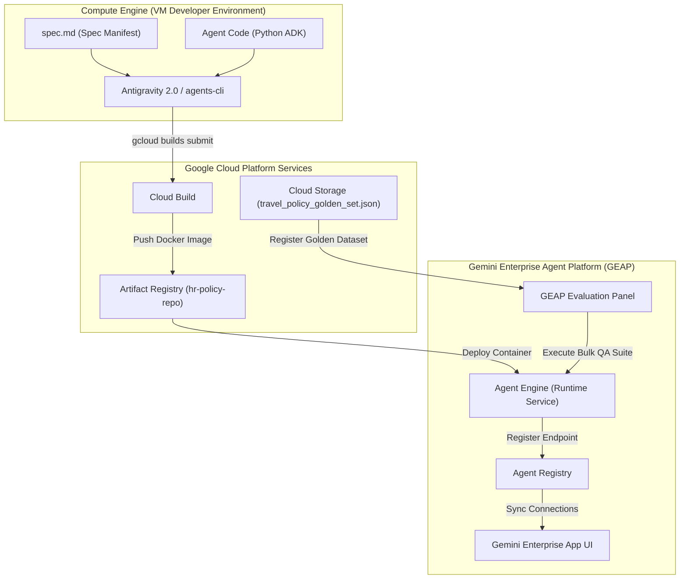

# Lab Guide: Challenge Lab - Gemini Enterprise Agent Platform (GEAP) Lifecycle Integration

## Overview

In this comprehensive challenge lab, you demonstrate mastery over the entire lifecycle of an enterprise generative AI agent within the Gemini Enterprise Agent Platform (GEAP) ecosystem. This challenge brings together the development, runtime security, containerized platform deployment, and automated quality evaluation workflows practiced across all previous advanced agentic skills modules.

---

## What Googlers will learn:

In this lab, you learn how to perform the following tasks:
- Scaffold an operational ADK-based travel expense policy agent utilizing reasoning models and Model Context Protocol (MCP) integrations via Antigravity 2.0.
- Compile, containerize, and deploy a secured enterprise agent container to Agent Runtime using Cloud Build and Artifact Registry.
- Enroll the functional application endpoint into the Agent Registry and map the identity properties for GE App connectivity.
- Ingest an evaluation Golden Dataset into GEAP and execute a bulk automated evaluation run verifying grounding, accuracy, and safety against production metrics.

### What you must demonstrate:
* **Concepts Understood**:
  * The difference between development-time model testing and containerized production-time deployment on the Agent Engine architecture.
  * Identity mapping and trust configurations required for connecting third-party agent runtimes safely to the Gemini Enterprise (GE) App chat interface.
  * The necessity of continuous automated evaluation (evals) over manual testing to enforce policy compliance, prevent hallucinations, and catch regression.
* **Skills Applied**:
  * Authoring semantic grounding rules and declaring capabilities within an ADK-compliant `spec.md` manifest.
  * Utilizing `agents-cli` and `gcloud` developer tools to coordinate remote containerization, repository push, and runtime environment orchestration.
  * Registering enterprise web services in the Agent Registry with secure schema mappings (`register-agent.json`).
  * Binding and configuring automated evaluation suites (Grounding, Relevancy, Guideline Adherence) on GEAP using Google Cloud Storage dataset pools.
* **Decisions Made Independently**:
  * Designing optimal target travel personas and grounding boundary instructions for the agent within `spec.md` to prevent policy bypass.
  * Resolving networking route boundaries to expose the Agent Engine runtime service layer securely to the GE App environment.
  * Evaluating model accuracy reports in GEAP to decide if the deployed agent is production-ready or if instruction adjustments are required.

---

## Challenge Scenario

You are a Platform Customer Engineer at Google working with Cymbal Group. Following initial design workshops, the Chief Human Resources Officer (CHRO) and IT Security teams have approved the development of a Proof of Concept (POC) for an enterprise-wide **Travel Expense Policy Concierge Agent** serving Cymbal Group’s 200,000 global employees. 

The target solution must be ready for production deployment via Gemini Enterprise Agent Platform (GEAP); it must correctly answer employee queries regarding travel expense caps and guidelines across various global regions, anchoring its logic in corporate handbooks via an MCP tool.

The deployment must utilize the Gemini Enterprise Agent Platform enterprise stack from containerized deployment on Agent Engine to registration and discovery within the central Agent Registry, and client exposure via the GE App chat interface. 

Furthermore, you must programmatically execute a batch validation cycle inside the Gemini Enterprise Agent Platform using the compliance team's Golden Dataset to prove the agent meets strict threshold constraints for grounding, policy alignment, and response correctness.

Your workspace is a pre-provisioned Compute Engine instance loaded with Python 3.11+, `agents-cli`, and Google Antigravity 2.0. You have minimal instruction; your final success is judged strictly by automated platform validation checks across your deployment lifecycle.

---

## 🛠️ System Architecture

The following Mermaid diagram visualizes the end-to-end architecture and runtime pathways you will construct and validate in this challenge lab:

---

## High-Level Task List

### Task 1: Prepare the Environment and Security Endpoints
In this task, you prepare your developer VM, activate required platform licenses, and configure the semantic model agent specifications.

1. **Activate and assign your Gemini Enterprise license**:
   - Run the platform verification script to bind your sandbox GCP project to your Gemini Enterprise workspace.
   - Confirm active developer entitlement by querying the registry license pool.
2. **Launch your VM and check environment health**:
   - Establish a persistent terminal connection to your Compute Engine instance.
   - Run a diagnostic command to ensure `python3 --version` is `3.11+` and `agents-cli` is successfully installed and added to your `PATH`.
3. **Author the `spec.md` configuration manifest**:
   - Create a structured `spec.md` at the root of your lab folder. 
   - Define target travel personas (e.g., default employee, international regional lead).
   - Document specific grounding boundary guidelines (e.g., direct fallback responses if questions fall outside official Cymbal Group travel policies).
   - Outline the MCP (Model Context Protocol) tool configurations allowing the agent to reference the internal corporate knowledge base securely.
4. **Generate the agent codebase**:
   - Invoke Antigravity 2.0 with your authored `spec.md` to bootstrap the fully operational, ADK-compliant Python server boilerplate.
   - Review the generated folder layout to confirm the presence of dependencies, web-server routing files, and tools.

---

### Task 2: Package, Deploy, and Register the Secured Agent
In this task, you build a production-ready container, deploy it to Google Cloud's scalable Agent Engine, and register it globally inside GEAP.

1. **Provision Artifact Registry**:
   - Create a Google Artifact Registry Docker repository named `hr-policy-repo` in region `us-central1`.
   - Ensure permissions allow automated Cloud Build read/write actions.
2. **Build and push the agent container**:
   - Execute a Cloud Build trigger using `gcloud builds submit` to remotely compile and tag your agent application into `us-central1-docker.pkg.dev/<project-id>/hr-policy-repo/travel-concierge:latest`.
3. **Deploy the application container**:
   - Provision a runtime instance on the Agent Engine container service layer.
   - Record the live external HTTPS endpoint URI generated by your deployment.
4. **Register the agent with the Agent Registry**:
   - Craft a file named `register-agent.json` containing the live service URI, secure system metadata, and workspace identity roles.
   - Enroll the endpoint using `agents-cli register --config=register-agent.json` to create a permanent record in the central registry.
5. **Establish GE App mapping**:
   - Bind the registered agent’s identity mapping rules to make it discoverable within the Gemini Enterprise App workspace.

---

### Task 3: Execute Batch Quality Evaluations via GEAP
In this task, you execute programmatic grounding checks against the compliance dataset to ensure response safety and accuracy before human rollout.

1. **Navigate to the Evaluation panel**:
   - Access the GEAP administrative control plane dashboard.
2. **Register the Golden Dataset**:
   - Locate the pre-populated compliance testing file `travel_policy_golden_set.json` in your project's default regional Cloud Storage bucket.
   - Link the dataset asset into the GEAP Evaluation dataset registry.
3. **Configure and execute the evaluation suite**:
   - Launch a new automated bulk evaluation job targeting your deployed agent's endpoint.
   - Apply three standard evaluation metrics:
     * **Grounding Accuracy**: Measures how strictly answers stick to cached documentation.
     * **Answer Relevance**: Rates whether the output directly solves the employee's core query.
     * **Adherence to Guidelines**: Confirms that boundary rules are followed (e.g., blocking adversarial/unrelated prompts).
4. **Analyze evaluation history and pass thresholds**:
   - Open the completed run reports.
   - Verify that standard queries receive a passing score limit (>0.80) and that adversarial attempts (e.g., "Write a poem about travel") are successfully defended and logged as compliant blocks.

---

## Technical Requirements for the Lab

### Required Cloud Environments:
* A Google Cloud Platform (GCP) sandbox project.
* An active Gemini Enterprise tenant/workspace domain.

### Required Data Sources when Lab Starts:
* **MCP Travel Server**: Pre-configured to serve Cymbal Group travel policies.
* **`travel_policy_golden_set.json`**: A pre-built, multi-turn testing dataset located inside the project's default Cloud Storage bucket layer (`gs://<project-id>-assets/travel_policy_golden_set.json`).

### Existing Resources Automatically Available when Lab Starts:
* A Compute Engine VM instance preloaded with:
  * Python 3.11+ environment
  * Google Antigravity 2.0 CLI
  * `agents-cli` SDK packages
  * A copy of the Cymbal Group Global Travel and Expense handbook

---

## Validation and Scoring

The lab features non-interactive step-by-step progress tracking. You will submit your overall deployment for automated scoring against the following checkpoints:

| Checkpoint | Target Resource | Validation Criteria / Verification command | Score Weight |
| :--- | :--- | :--- | :--- |
| **Checkpoint 1** | Artifact Registry Image | Validates that `us-central1-docker.pkg.dev/<project_id>/hr-policy-repo/travel-concierge` exists and contains a compilation metadata signature. | 25% |
| **Checkpoint 2** | Agent Engine Runtime | Pings the live Agent Runtime endpoint; verifies the status reports active and is mapped in the Agent Registry matching `register-agent.json`. | 25% |
| **Checkpoint 3** | GE App Connectivity | Verifies that GE App can discover the agent, resolve workspace credentials, and authenticate using mapping properties. | 25% |
| **Checkpoint 4** | GEAP Evaluation Logs | Confirms that a batch evaluation job execution log payload matches the designated `travel_policy_golden_set.json` run and records passing score limits (>0.80). | 25% |

> [!CAUTION]
> **No Mid-Lab Feedback**
> Step-by-step guidance is disabled. To earn credit, you must complete the entire sequence from VM setup through evaluation reports before triggering the final score validation.
