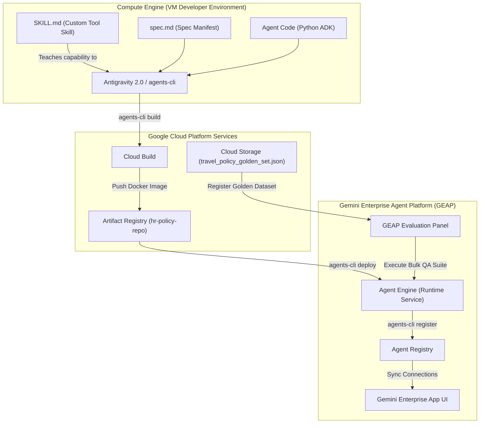

# Lab Guide: Challenge Lab - Gemini Enterprise Agent Platform (GEAP) Lifecycle Integration

## Overview

In this comprehensive challenge lab, you demonstrate mastery over the entire lifecycle of an enterprise generative AI agent within the Gemini Enterprise Agent Platform (GEAP) ecosystem. This challenge brings together the development, runtime security, containerized platform deployment, and automated quality evaluation workflows practiced across all previous advanced agentic skills modules.

Distinct from typical hands-on labs, this challenge introduces the core philosophy of **Agentic Engineering**: instead of performing manual shell commands to package and deploy, you will **design and register a custom Antigravity Skill** that teaches your AI pair programmer (Antigravity 2.0) how to interact with the GCP and `agents-cli` developer toolset to build, deploy, and register your application autonomously on your behalf.

---

## 📦 Lab Prerequisites & Required Resources

This is a comprehensive challenge lab. To successfully complete the tasks, you must retrieve and adapt core resources from your previous lab modules in this series. You can use these completed files as templates or build upon them to complete this lab:

| Required Resource | Description / Purpose | Sourced From Previous Labs | Implementation Details |
| :--- | :--- | :--- | :--- |
| **`docs/corporate_travel_policy.txt`** OR **`docs/Cymbal Group Global Travel and Expense Policy.pdf`** | The complete 104 KB text travel handbook detailing global limits and rules, and the official visual PDF guidelines. | **Lab 3.1** or **Lab 3.4** | Place both the text handbook and PDF guidelines under the `docs/` subdirectory of your challenge lab folder as your agent's knowledge source. |
| **`spec.md`** | Agent specification sheet defining travel personas and grounding limitations. | **Lab 3.1** | Use your completed spec sheet from Lab 3.1 as your baseline to adapt or build upon. |
| **`skills/agents-cli/SKILL.md`** | Instruction set teaching Antigravity how to run CLI commands on your behalf. | **Lab 3.4** | Utilize the custom skill structure and formats studied in Lab 3.4 to build your CLI skill. |
| **`travel_policy_golden_set.json`** | Evaluation configuration and multi-turn QA dataset. | **Lab 3.3** | Retrieve from Lab 3.3 or build your own. This file packages both the evaluation config and test dataset. It orchestrates the automated quality check utilizing **Vertex AI Rapid Evaluation** to score groundedness, fulfillment, and safety. Upload it to `gs://<project-id>-assets/travel_policy_golden_set.json`. |

---

## What Googlers will learn:

In this lab, you learn how to perform the following tasks:
- Design and register a custom Antigravity Skill manifest instructing an AI agent on how to coordinate specialized CLI-based deployment tools.
- Scaffold an operational ADK-based travel expense policy agent utilizing reasoning models and Model Context Protocol (MCP) integrations via Antigravity 2.0.
- Direct Antigravity 2.0 to autonomously compile, containerize, and deploy a secured enterprise agent container to Agent Runtime.
- Enroll the functional application endpoint into the Agent Registry and map the identity properties for GE App connectivity via agent-driven orchestration.
- Ingest an evaluation Golden Dataset into GEAP and execute a bulk automated evaluation run verifying grounding, accuracy, and safety against production metrics.

### What you must demonstrate:
* **Concepts Understood**:
  * The difference between development-time model testing and containerized production-time deployment on the Agent Engine architecture.
  * Identity mapping and trust configurations required for connecting third-party agent runtimes safely to the Gemini Enterprise (GE) App chat interface.
  * The necessity of continuous automated evaluation (evals) over manual testing to enforce policy compliance, prevent hallucinations, and catch regression.
  * How to define and map external commands and variables into structured instruction sheets (`SKILL.md`) to enable agent-controlled tooling.
* **Skills Applied**:
  * Authoring semantic grounding rules and declaring capabilities within an ADK-compliant `spec.md` manifest.
  * Writing capability instruction specs with YAML frontmatter to add new terminal competencies to an LLM agent.
  * Utilizing `agents-cli` and `gcloud` developer tools through agent-driven execution to automate packaging, deployment, and registry enrollment.
  * Registering enterprise web services in the Agent Registry with secure schema mappings (`register-agent.json`).
  * Binding and configuring automated evaluation suites (Grounding, Relevancy, Guideline Adherence) on GEAP using Google Cloud Storage dataset pools.
* **Decisions Made Independently**:
  * Designing optimal target travel personas and grounding boundary instructions for the agent within `spec.md` to prevent policy bypass.
  * Formatting clean capabilities and regex-like parameters inside `SKILL.md` to give your agent foolproof operational capabilities.
  * Evaluating model accuracy reports in GEAP to decide if the deployed agent is production-ready or if instruction adjustments are required.

---

## Challenge Scenario

You are a Platform Customer Engineer at Google working with Cymbal Group. Following initial design workshops, the Chief Human Resources Officer (CHRO) and IT Security teams have approved the development of a Proof of Concept (POC) for an enterprise-wide **Travel Expense Policy Concierge Agent** serving Cymbal Group’s 200,000 global employees. 

The target solution must be ready for production deployment via Gemini Enterprise Agent Platform (GEAP); it must correctly answer employee queries regarding travel expense caps and guidelines across various global regions, anchoring its logic in corporate handbooks via an MCP tool.

Rather than managing standard lower-level DevOps shell actions yourself, you decide to leverage your pre-provisioned developer environment to demonstrate the power of generative operations. You will build and test a custom **Antigravity Skill** that defines how to use Google’s standard `agents-cli` deployment tool. Once trained, you will direct your Antigravity 2.0 agent to build, containerize, deploy, and register your Cymbal Travel Policy Concierge Agent autonomously.

Your workspace is a pre-provisioned Compute Engine instance loaded with Python 3.11+, `agents-cli`, and Google Antigravity 2.0. You have minimal instruction; your final success is judged strictly by automated platform validation checks across your deployment lifecycle.

---

## 🛠️ System Architecture

The following Mermaid diagram visualizes the end-to-end architecture and runtime pathways you will construct and validate in this challenge lab:

---

## High-Level Task List

### Task 1: Prepare the Environment, Security Endpoints, and Custom Agent Skill
In this task, you prepare your developer VM, configure the semantic model agent specifications, and teach Antigravity how to use the deployment CLI.

1. **Activate and assign your Gemini Enterprise license**:
   - Run the platform verification script to bind your sandbox GCP project to your Gemini Enterprise workspace.
   - Confirm active developer entitlement by querying the registry license pool.
2. **Launch your VM and check environment health**:
   - Establish a persistent terminal connection to your Compute Engine instance.
   - Run a diagnostic command to ensure `python3 --version` is `3.11+` and `agents-cli` is successfully installed and added to your `PATH`.
3. **Author the `spec.md` configuration manifest**:
   - Create a structured `spec.md` at the root of your lab folder. 
   - Define target travel personas (e.g., default employee, international regional lead).
   - Document specific grounding boundary guidelines (e.g., direct fallback responses if questions fall outside official Cymbal Group travel policies).
   - Outline the MCP (Model Context Protocol) tool configurations allowing the agent to reference the internal corporate knowledge base securely.
4. **Author and register the Custom `agents-cli` Skill**:
   - Inside your lab folder, create the path `skills/agents-cli/` and write a **`SKILL.md`** file.
   - The skill file must begin with valid YAML frontmatter defining a descriptive name (e.g., `agents-cli-orchestrator`) and a short summary of its operational intent.
   - Detail precise instructions guiding an LLM on how to map parameters and execute terminal commands for:
     * **`agents-cli build`**: Packaging the codebase and building remote docker containers.
     * **`agents-cli deploy`**: Deploying the compiled image to Agent Engine and capturing the resulting runtime endpoint.
     * **`agents-cli register`**: Enrolling the endpoint to the Agent Registry with `register-agent.json`.
   - Register this skill under Antigravity's active skill configurations using `agents-cli register-skill`. Confirm that your pair programmer has successfully loaded and parsed the instructions.
5. **Generate the agent codebase**:
   - Invoke Antigravity 2.0 with your authored `spec.md` to bootstrap the fully operational, ADK-compliant Python server boilerplate.
   - Review the generated folder layout to confirm the presence of dependencies, web-server routing files, and tools.

---

### Task 2: Package, Deploy, and Register the Agent via Skill Orchestration
In this task, you orchestrate the container build, Agent Engine deployment, and central registry enrollment by directing Antigravity 2.0 to invoke its newly acquired skill.

> [!IMPORTANT]
> **Mandatory Agentic Orchestration**
> To receive credit for Task 2, you must **not** run the compilation or deployment commands yourself in the shell. Instead, you must instruct your Antigravity 2.0 chat session to execute these tasks using its registered `agents-cli` skill. The scoring engine verifies command history and execution trails to check that Antigravity was the driver.

1. **Provision Artifact Registry**:
   - Create a Google Artifact Registry Docker repository named `hr-policy-repo` in region `us-central1`.
   - Ensure permissions allow automated Cloud Build actions.
2. **Command the Agent to build, deploy, and register**:
   - Prompt Antigravity in your chat window:
     > *"Please use your newly learned `agents-cli` skill to package my travel concierge agent, compile it into the `hr-policy-repo` Artifact Registry, deploy it to us-central1 Agent Engine, and register the resulting live endpoint using register-agent.json."*
   - Let Antigravity analyze your workspace configurations, read `register-agent.json`, generate terminal commands, and perform the operations sequentially.
3. **Audit and verify execution trails**:
   - Observe Antigravity's console actions. Ensure it correctly captures the dynamically generated external HTTPS endpoint from `deploy` output and updates `register-agent.json` before triggering `register`.
4. **Establish GE App mapping**:
   - Bind the registered agent’s identity mapping rules to make it discoverable within the Gemini Enterprise App workspace.

---

### Task 3: Execute Batch Quality Evaluations via GEAP
In this task, you execute programmatic grounding checks against the compliance dataset to ensure response safety and accuracy before human rollout.

1. **Navigate to the Evaluation panel**:
   - Access the GEAP administrative control plane dashboard.
2. **Register the Golden Dataset**:
   - Retrieve the compliance testing file `travel_policy_golden_set.json` from **Lab 3.3** or construct/custom-build your own testing dataset.
   - Upload this file to your project's default regional Cloud Storage bucket (`gs://<project-id>-assets/travel_policy_golden_set.json`).
   - Link the dataset asset into the GEAP Evaluation dataset registry dashboard.
3. **Configure and execute the evaluation suite**:
   - Launch a new automated bulk evaluation job powered by **Vertex AI Rapid Evaluation** targeting your deployed agent's endpoint.
   - Apply three standard evaluation metrics:
     * **Groundedness**: Measures how strictly answers stick to the retrieved corporate handbook documentation.
     * **Fulfillment**: Rates whether the output successfully answers and resolves the employee's core query.
     * **Safety**: Confirms that boundary rules are followed (e.g., blocking adversarial/unrelated prompts, HR queries, and preventing hallucinations).
4. **Analyze evaluation history and pass thresholds**:
   - Open the completed run reports.
   - Verify that standard queries receive a passing score limit (>0.80) and that adversarial attempts (e.g., "Write a poem about travel") are successfully defended and logged as compliant blocks.

---

## Technical Requirements for the Lab

### Required Cloud Environments:
* A Google Cloud Platform (GCP) sandbox project.
* An active Gemini Enterprise tenant/workspace domain.

### Required Data Sources when Lab Starts:
* **MCP Travel Server**: Pre-configured to serve Cymbal Group travel policies.
* **`travel_policy_golden_set.json`**: A multi-turn testing dataset retrieved from **Lab 3.3** (or custom-built) and uploaded to the project's Cloud Storage bucket layer (`gs://<project-id>-assets/travel_policy_golden_set.json`).

### Existing Resources Automatically Available when Lab Starts:
* A Compute Engine VM instance preloaded with:
  * Python 3.11+ environment
  * Google Antigravity 2.0 CLI
  * `agents-cli` SDK packages
  * A copy of the Cymbal Group Global Travel and Expense handbook

---

## Validation and Scoring

The lab features non-interactive step-by-step progress tracking. You will submit your overall deployment for automated scoring against the following checkpoints:

| Checkpoint | Target Resource | Validation Criteria / Verification command | Score Weight |
| :--- | :--- | :--- | :--- |
| **Checkpoint 1** | Custom Antigravity Skill | Verifies that `skills/agents-cli/SKILL.md` exists, contains correct YAML frontmatter, and is registered in active Antigravity skill paths. | 20% |
| **Checkpoint 2** | Artifact Registry Image | Validates that `us-central1-docker.pkg.dev/<project_id>/hr-policy-repo/travel-concierge` exists and contains a compilation metadata signature. | 20% |
| **Checkpoint 3** | Agent Engine Runtime | Pings the live Agent Runtime endpoint; verifies the status reports active and is mapped in the Agent Registry matching `register-agent.json`. | 20% |
| **Checkpoint 4** | GE App Connectivity | Verifies that GE App can discover the agent, resolve workspace credentials, and authenticate using mapping properties. | 20% |
| **Checkpoint 5** | GEAP Evaluation Logs | Confirms that a batch evaluation job execution log payload matches the designated `travel_policy_golden_set.json` run and records passing score limits (>0.80). | 20% |

> [!CAUTION]
> **No Mid-Lab Feedback**
> Step-by-step guidance is disabled. To earn credit, you must complete the entire sequence from VM setup and custom skill registration through evaluation reports before triggering the final score validation.
